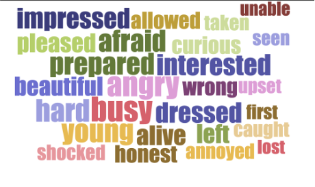
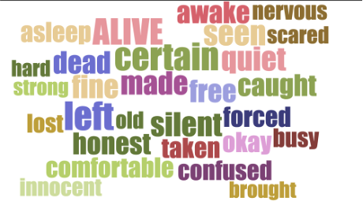
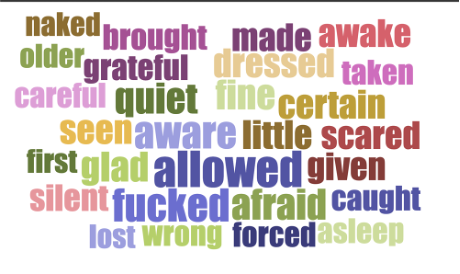
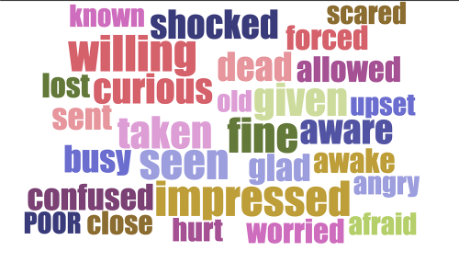

Data, and Interpretation: Fanfiction and Racial Representation

Part One: The Bigger Picture

In the Book Chapter &ldquo;Abstraction, Singularity, Textuality: The Equivalence of &ldquo;Close&rdquo; and &ldquo;Distant&rdquo; Reading&rdquo;, Katherine Bode discussed several controversial research methods provided by the Digital Humanities scholars. One of them is the conflict between data and interpretation. Bode pointed out that both Jockers and Moretti may have the inclination to overestimate the power of bibliographic data and underestimate literary interpretation. Bode quotes from Moretti&rsquo;s work &ldquo;the first chapter of Graphs repeatedly references &ldquo;the large mass of [literary] facts&rdquo; as &lsquo;ideally independent of interpretations&rsquo; (Moretti 3), as &ldquo;data, not interpretation&rdquo; (9), and as &ldquo;useful because they are independent of interpretation&rdquo; (30). At the same time, Bode pointed out that Jockers also had an inclination to dismiss literary interpretation as defective, &ldquo;While interpretation and observation are &lsquo;anecdotal and speculative,&rsquo; &lsquo;big data&rsquo; is supposedly constituted without human involvement and thus offers &lsquo;comprehensive and definitive&rsquo; historical facts&rdquo; (Bode). However, Bode argued that these approaches might have their own problems. For example, &ldquo;The network visualizations with which Jockers presents the cumulative results of macroanalysis reinforce this view of literary data as literary data as factual and comprehensive&rdquo; (23), which might not be the case in real life. Also, these big data analyses may loss the contextual background in terms of time and space. &ldquo;But literary works are not defined by a single time and place, and collecting them together in those abstract terms does not represent the interconnections that constitute literary systems&rdquo; (27). Generally, it might not always be plausible to think data collected from the digital archives as self-evident, or comprehensive.&nbsp;

Then is there a way to conduct big data analysis in the literary realm with analysis? Rachael Scarborough King proposed an idea to study genre by &ldquo;arguing for the privileged position of genre at the middle scale in literary studies&rdquo; (261), which can stand between &ldquo;distant reading and close reading as the two ends of literary scale, a

contrast that raises the ongoing question of how to move between the generalizations about a corpus of texts provided by computational methods and the individual scholar&rsquo;s observations about an idiosyncratic text, the traditional method of literary study&rdquo;. Though I am not focusing on genre studies in this experiment, this idea of a middle scale is still illuminating, as it offers a possible way to stand in between big data and traditional literary analysis. Therefore, in this experiment, I will try to combine data analysis and literary interpretation. First, I am not trying to be comprehensive in terms of data collection. What I am conducting is a particular case study, and I will not go as far away as to say that it can represent the whole picture of the genre I am talking about, but it may still give hints of which direction we would go next. At the same time, besides <em>how</em> and <em>what</em> I got out from the big data analysis, I am also (and even more) invested in <em>why</em> such results happen and to what extend can we elaborate from the results. In this way, I try to make use of the advantages of Digital Humanities while also trying to avoid some possible deficiencies on relying to much on data to be self-evident.&nbsp;

Part Two: Why Racial Representation in Fanfiction

 In order to conduct this experiment in a smaller scale, I chose fanfiction as a particular genre, and focused on racial representation in fanfictional depictions. <em>&ldquo;(The Lord of the Rings movies)&nbsp;</em>tell a tale that people will strive to prove that people of all walks of life can work together, as long as they are all <em>white</em>&rdquo;&mdash;this is a critique from Screen Junkies, A Fandom Youtuber (Screen Junkies). This quote indicates that throughout the past decade, people are more invested in the representations of racial minorities in multi-media fandoms. At the same time, we also see changes on the screen, as these days, we have witnessed a diversity of actors and characters in popular films and TV shows besides traditional dominated white males. They are beginning to serve not only as supporting characters, but also protagonists as well. &ldquo;African American actress Regina King is the star in an HBO adaptation of D.C.&rsquo;s &lsquo;The Watchmen,&rsquo; premiering Oct. 20, 2019; Marvel&rsquo;s Pakistani American superhero Kamala Khan is getting a standalone series on Disney Plus&rdquo; are just several examples of the ongoing efforts for racial diversity on screen (Robbins).&nbsp;

 The more diversified new media representations also inspired fanfiction writers to include more racially diverse characters in their works. Nevertheless, though race has become one of the center points of discussion in the original multimedia fandoms, very few academic studies have been done connecting racial studies to derivative fan-related activities. For example, &ldquo;Transformative Works and Cultures&rdquo;, the leading journal of fan studies, devoted a special issue in 2019 called &ldquo;Fans of Color, Fandoms of Color&rdquo; to discuss the representation of people of color in fan studies. In this issue, we see several articles that link racial representation in fan fiction, ranging from affective racial politics (Guarriello), Black storying (Thomas and Stornaiuolo), and race in science fiction fandoms (Morris). But even taking these efforts into account, we are still witnessing an academic niche here. This becomes a rather problematic issue, especially compared to the enormous amount of gender and queer-related issues about fanfiction in academia.&nbsp;

 But fanfiction as a highly digital genre is worth discussion, especially from a Digital Humanities context. Digitally available fanfiction texts are easy to scrape from Archives of Our Own (AO3), one of the world&rsquo;s largest fanfiction website, which provides huge convenience for researcher to collect raw data. Therefore, I chose to focus on a selection of fanfiction texts, and discuss the representation of racial minorities (especially black characters) in these fanfictions. The major questions I am asking are: Are there general patterns and possible stereotypes in Black representation in fanfiction? If so, what are they and how can we interpret the reasons and effects behind these patterns and stereotypes?&nbsp;

Part Three: The Experiment&nbsp;

<strong></strong>Instead of randomly choosing fanfictions, I decided to focus on Black Panther, the 2018 movie by Marvel as a particular fandom example to study Black representation. I made this choice because 1) focusing on a particular fandom will make it easy to generate character list and race distribution, so that I can identify what patters are describing what characters in what ethnicity; 2) Black Panther is a movie with a majority of black characters (including all the protagonists), and the Marvel Cinematic Universe (MCU), which fanfictions usually tend to crossover with Black Panther, also has many white characters to provide comparison.&nbsp;

 I have two datasets for this experiment. The first is a character list of major characters in Black panther and in MCU scraped from Wikipedia. In this list, we have character&rsquo;s name, genders, and nicknames so that we can extract most cases where they are being referred. The second dataset includes 1679 English-written fanfiction tagged with &ldquo;Black Panther (2018)&rdquo; scraped from AO3. All the fanfictions are completed and are selected by the number of &ldquo;Kudos&rdquo;, and I also excluded all crossover fanfiction (crossover outside of MCU) so that my character list would be more comprehensive.&nbsp;

; The next step is to generate lists of words that describe these characters. Because simple word embedding tools might not be accurate enough, I made use of dependency parser and coreference resolution. Dependency parsing is the task of analyzing the syntactic dependency structure of a given input sentence S, and in our case, I analyzed the structure of all the sentences in my two datasets (Chen and Manning). Coreference resolution is the task of finding all expressions that refer to the same entity in a text (&ldquo;Coreference Resolution&rdquo;). In my case, I adopted reinforcement learning models and used the neuralcoref package to find descriptive words (like adjectives) to particular characters(including their names and the pronouns that refer to them) (Clark and Manning; <em>NeuralCoref 4.0</em>).&nbsp;

Part Four: Results and Discussions&nbsp;

First, I generally focused on adjectives, since I believed that these words might carry stereotypical connotations. Here are the four most frequently appeared characters, Black Panther (Black male) and Winter Soldier (White male), Killmonger (Black male) and Tony Stark (White male). I excluded Suri because she is female and gender might influence the results (I excluded the most common descriptors, which are more functional and largely similar).&nbsp;

Figure 1: Top 21-50 descriptor words for Black Panther (Black male)

Figure 2: Top 21-50 descriptor words for Bucky (White male)

Figure 3:Top 21-50 descriptor words for Killmonger (Black male)

Figure 4:Top 21-50 descriptor words for Tony Stark (White male)

&nbsp;

There are two features that I noticed from the word cloud. First, in Bucky and Tony&rsquo;s frequent descriptors, there are several words that indicate traumatization (&ldquo;nervous&rdquo;, &ldquo;scared&rdquo;, &ldquo;confused&rdquo;, &ldquo;caught&rdquo;, &ldquo;taken&rdquo;, &ldquo;shocked&rdquo;, etc. ). This might due to the fact that both characters did experience great post-war PTSD in the movies. Second, for Killmonger, the villain in the Black Panther, we found porn-related words like &ldquo;fucked&rdquo; and &ldquo;naked&rdquo;, which don&rsquo;t usually come out as words that are most frequently associated with characters.&nbsp;

From the result, I began to wonder if black characters in Black Panther fanfictions are more related to sexualized terms, so I looked specifically at some porn related works and their frequency in these references.&nbsp;

For example, the word &ldquo;fucked&rdquo; has the frequency of 0.49% and 2.8% in Black Panther and Killmonger, while only has 0.42% in Bucky and 0.40% in Tony Stark. For the word &ldquo;pregnant&rdquo;, Killmonger also has a 0.96% of reference (because of the MalePreg settings in fanfiction, which is usually related to pornography). Shuri has a 1.07% reference, and several other black female characters (Nakia and Okoye) also have several mentioning, compared to no mentioning in any white male characters, and almost no white female characters.&nbsp;

I wish to interpret these results from several fathoms. To begin with, these results may suggest that at least in Black Panther fanfiction, Black characters are more sexualized than white characters. To what extent can we trust this result? First, we need to acknowledge that it is not because these black characters are mentioned and discussed fewer times that made them more sexualized or biased (which can happen when you are describing a flat side character). As I tracked the number of clusters related to all major characters (these clusters include not only name frequency, but also times when they are mentioned by pronouns), Black Panther ranks the first, killmonger ranks the third, and Shuri ranks the fourth. These are all black characters. Comparatively, Winter Soldier ranks second and Iron Man ranks the sixth. That is to say, even with enough mentions, black characters in our dataset is still more associated with sexualized terms. Then is it because of the focus on these characters are different, that black characters have more romantic relationships to be described than white characters in Black Panther, which leads to more sexualized terms? This doubt can partly be refuted by the statistics of verbs related to these characters. While my main focus is on adjectives, I also did an experiment on verbs related to the characters. What I found is that verbs that indicate personal relationships, such as &ldquo;love&rdquo; or &ldquo;kiss&rdquo;, have no significant statistical differences between white and black characters. This indicates that though both white and black characters are described as having personal relationships with others, black characters are still inclined to be depicted as more sexualized.&nbsp;

To further interpret this result, we might suggest that there is still a lack of development of racial minority characters depicted in fandoms and fanfictions. For Marvel, even though we have seen Black characters, Latino characters, and Asian characters being the protagonists and significant supporting characters, we still generally see more complexity in white characters, like the development of Tony Stark and the Winter Soldier with their psychological complexities. For fanfictions derived from these fandoms, we see a similar trend in which round white characters are explored more deeply. Though there are fanfictions that seek to &ldquo;fix&rdquo; some problems of racial representations in the original fandoms (like racebending, alternate universe), these efforts have not yet posed significant results on the fan communities as a whole.&nbsp;

Part Four: Conclusion and Perspectives

This is an experiment that tries to link big data analysis with literary interpretations. I start with a literary question &ndash; racial stereotypes in fanfiction, and uses big data analysis to gain statistical results of descriptive words related to different characters. Then I looked back to interpret the data that I collective again from a literary perspective, and suggested how this can indicate problems in character depiction and development in fanfictions. I would regard this as a combination of big data analysis and literary examination, which does not fall into the trap of treating data as self-evident.&nbsp;

At the same time, I also acknowledge that there are still things to further push this experiment. If I were to further examine whether black characters are indeed more sexualized even with the same amount of romantic relationships described, I need to focus on specific &ldquo;ships&rdquo;, and I might even need to pull descriptions from white-character-dominant fandoms to serve as a comparison. This means that in the future, I am going to scrape texts from AO3 through more relationship related tags, and may also focus more on Explicit and Mature rated fanfictions to examine sexualized terms further.&nbsp;

References

Bode, Katherine. &ldquo;Abstraction, Singularity, Textuality: The Equivalence of &lsquo;Close&rsquo; and &lsquo;Distant&rsquo; Reading.&rdquo; <em>A World of Fiction</em>, University of Michigan Press, 2018, pp. 17&ndash;36. <em>JSTOR</em>, http://www.jstor.org/stable/j.ctvdtpj1d.5.

Chen, Danqi, and Christopher D. Manning. &ldquo;A Fast and Accurate Dependency Parser Using Neural Networks.&rdquo; <em>Proceedings of the 2014 Conference on Empirical Methods in Natural Language Processing (EMNLP)</em>, 2014, pp. 740&ndash;50.

Clark, Kevin, and Christopher D. Manning. &ldquo;Deep Reinforcement Learning for Mention-Ranking Coreference Models.&rdquo; <em>Proceedings of the 2016 Conference on Empirical Methods in Natural &nbsp; &nbsp; &nbsp; &nbsp; &nbsp; Language Processing</em>, Association for Computational Linguistics, 2016, pp. 2256&ndash;62. <em>DOI.org (Crossref)</em>, https://doi.org/10.18653/v1/D16-1245.

&ldquo;Coreference Resolution.&rdquo; <em>The Stanford Natural Language Processing Group</em>, https://nlp.stanford.edu/projects/coref.shtml. Accessed 16 Dec. 2021.

Guarriello, Nicholas-Brie. &ldquo;Affective Racial Politics in &lsquo;How to Get Away with Murder&rsquo; Fan Fiction.&rdquo; <em>Transformative Works and Cultures</em>, vol. 29, Mar. 2019. <em>journal.transformativeworks.org</em>, https://doi.org/10.3983/twc.2019.1471.

Morris, Susana. &ldquo;&lsquo;Speculative Blackness: The Future of Race in Science Fiction,&rsquo; by Andr&eacute; m. Carrington.&rdquo; <em>Transformative Works and Cultures</em>, vol. 29, Mar. 2019. <em>journal.transformativeworks.org</em>, https://doi.org/10.3983/twc.2019.1743.

<em>NeuralCoref 4.0: Coreference Resolution in SpaCy with Neural Networks.</em>&nbsp;2017. Hugging Face, 2021. <em>GitHub</em>, https://github.com/huggingface/neuralcoref/blob/60338df6f9b0a44a6728b442193b7c66653b0731/neuralcoref/train/training.md.

Robbins, Lisa. &ldquo;Diversity in Fandom: How the Narrative Is Changing.&rdquo; <em>ASU News</em>, 18 Oct. 2019, https://news.asu.edu/20191018-creativity-diversity-fandom-how-narrative-changing.

Screen Junkies. <em>Honest Trailers - The Lord of the Rings</em>. 2012. <em>YouTube</em>, https://www.youtube.com/watch?v=AOIi9SjJvgU.

Thomas, Ebony Elizabeth, and Amy Stornaiuolo. &ldquo;Race, Storying, and Restorying: What Can We Learn from Black Fans?&rdquo; <em>Transformative Works and Cultures</em>, vol. 29, Mar. 2019. <em>journal.transformativeworks.org</em>, https://doi.org/10.3983/twc.2019.1562.

