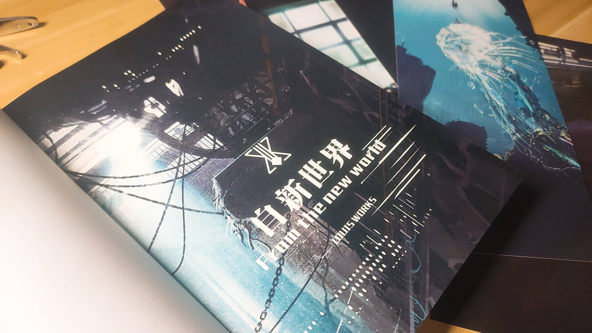
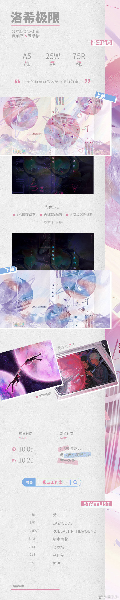
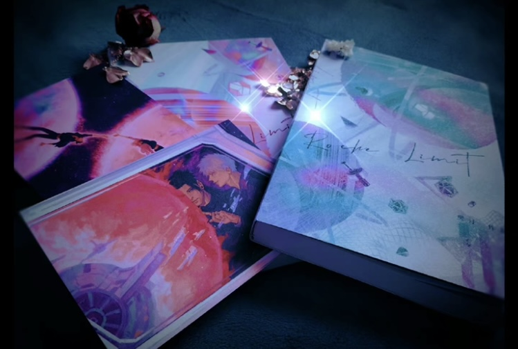

Fanfiction in Print: a Chinese context

Fanfiction is an essentially digital genre, especially given today&rsquo;s contexts. Though we have seen some fanfictions going on publishing (such as <em>Fifty Shades of Grey</em>), but a majority of fanfiction texts are still more heavily relying on online platforms. Catherine Coker discussed some of the related phenomenoa, &ldquo;I was once told that book history is not applicable to the study of fan fiction as, &quot;by definition,&quot; such writing is not disseminated in book form&mdash;that is, as a printed codex.&rdquo;&nbsp;(Coker)&nbsp;This suggests that fanfiction as a genre has not been expansively studied from a book history or a bibliographic perspective because of its digital essence. Coker went on to examine those few fanfictions that were actually published, and thus problematize the relation and distinction between print and digital.&nbsp;

Coker&rsquo;s work is very illuminating for me as a fan and a fan studies scholar, but I tend to look at a different context. While most of the examples &nbsp;that Coker provides are English-based in a western context, I chose to look at China, which is another ever-growing space for fanfiction production. What motivates fanfiction writers to make their works in print? How do they promote their printed works? These are the two questions that I wish to investigate in this experiment.&nbsp;

Generally, fanfictions in China tend to stay inside fan coteries. The space for fanfiction in China can be even more closed than a western context. Coker pointed out that in the Western contexts, &ldquo;Fan fiction is also published online, whether in private and locked communities (such as some fan Web sites and closed groups on LiveJournal), on a semipublic platform such as Wattpad (which requires users to provide an e-mail address and register as members), or in completely open archives such as FanFiction.net and the Archive of Our Own&rdquo;. But in China, almost all fanfiction publish communities are closed, to some extent. Lofter and Weibo, two platforms that fanfictions are published (online), all require registration of an account and also mobile apps to have access to. Also, very strict censorship systems have made it difficult to publish any text information with sensitive information related to adult content or political content. For example, words like &ldquo;government&rdquo;, &ldquo;police&rdquo;, and &ldquo;gun&rdquo; are all subject to censorship.&nbsp;

With this context, we then might understand that even for fanfictions that are in print, they are still very much restricted inside particular fan communities. First, fanfictions are generally not officially published in print (meaning having an ISBN and goes through a publisher to be published). There are several reasons why these novels are not published. First, many fanfictions are based on still going-on fandoms, and there might be copyright issues. Second, the publishing authorization process can be really long and tedious, and at the same time, the popularity of one fandom does not tend to last for long, so most fanfiction writers tend to self-print the works they have. Third, and more implicitly, is the fact that for a fanfiction to go through official publishing, there is an implication that it wants to spread its influence out of the fan coterie (Chuquan, or&nbsp;出圈&nbsp;in Chinese), but most writers don&rsquo;t actually want their works to have wide-spread influence, as it may attract more controversies. Fourth, some fanfictions contain sensitive information, which cannot go through official censorships. Therefore, most fanfiction writers publish their works through what they call &ldquo;independent publishing&rdquo;, and they are not official.&nbsp;

Then why are writers still publishing their works independently, when they already have an online version? From the blog posts that I see online, here are some reasons. The first thing is possible profit. For platforms like Lofter and Weibo, writers don&rsquo;t get direct economic profits writing fanfictions. But for independent publishing, they may benefit from the price difference between cost and retail price. Nevertheless, most fanfiction writers don&rsquo;t use this to make for a living. Most of the writers are the younger generations in their twenties, and some of they are even still students. They argue the benefits are &ldquo;only for some snacks&rdquo;, especially compared to the great amount of effort spent in the publishing and producing process. Therefore, though I list profit as the first reason, it is not the only reason for independent publishing for fanfiction, nor is it the most important reasons.&nbsp;

The second reason is for preservation. As I discussed in my previous <a href="https://github.com/peizhen123/BooklabFieldbook/blob/main/2022-04-04-labreport-i%20feel%20zine.md" target="_blank">lab post</a>, fanfictions published online are very unstable. They may simply be deleted without the author&rsquo;s consent. Making them into physical copies will help preserving these creative works. Also, for most fanfiction writers, there is a sense of fulfillment to see their works in print that they can hold in their hands. Usually, fanfiction writers treat their printed books not just as commodities, but more as artifacts worth preservation. Because of this, most fanfiction books are very delicately printed, sometimes using coated paper and linen paper even for textual production. They mainly resemble the hardcopies in publishing industries or those commemorative editions of popular fictions.&nbsp;

 
Figure 1. a picture of a fanfiction book (from Weibo ID:&nbsp;堂皇示刃)

Third is the social and communicative values of independent publishing a fanfiction work. Usually, fans, like the authors, wish to preserve the works they like in print. For popular works, there are usually fans living comments like &ldquo;how can I get a print version for my collection&rdquo;; &ldquo;I will definitely buy it no matter how much it costs when it is in print&rdquo;. And making a well-written fanfiction work in print will satisfy the fans needs, attracting them to read more works from the same author. At the same time, through communicating with fans about their needs on books in print, authors and fans create a more closed connection, because for longer stories, though fans usually are not directly involved in plot development, they can be involved in the print production through offering visual works, giving suggestions on print shops and print preferences, help in proofreading, etc.&nbsp;

 Forth, and this is especially true for longer fictional works, this printing and selling process help motivates authors to write longer fictions. In this age of fragmented reading, pictures get much more attention and &ldquo;kudos&rdquo; than textual productions, and one-piece short stories also get more attention because they are more easily consumed. Writers for longer fanfictional works suffer a lot from the lack of attention for longer works. A blog post, &ldquo;where are longer fanfiction writers?&rdquo; criticized this phenomenon, arguing that most of the &ldquo;swing fans&rdquo; no longer want to spend time on any longer fictions. This blog post has over one million reads. Making the longer fanfiction works in print help alleviate this anxiety for kudos, because authors can still receive positive feedbacks from fans buying their in-print works, which can be a great inspiration.&nbsp;

 After we discussed why authors put fanfictions in print, we can move on to talk about how authors are promoting their works. Still, I wish to emphasize that even though they are promoting their works, they are still targeting fans in the particular fandom or even ship they are writing.&nbsp;

 The first attraction they try to make is through the materials presented in the printed works. Unlike some online fiction platforms like Jinjiang, where authors will lock up chapters when their fictions get into print, fanfiction writers use special pictures and spin-off souvenirs to attract buyers. This is due to the fact that fanfiction as a genre is intrinsically heavily focusing on its sharing feature, so even when writers make their work in print, they still make them available in a digital form. Souvenirs can include well-designed postcards, stickers, badges, acrylic stands, etc. usually these souvenirs are self-designed and related to the fandom, and they are light in weight so that they don&rsquo;t seriously impact the shipping fees. In this way, fans who buy the print versions get what is not in the digital platforms.&nbsp;

 Second, authors will publish promotional information online, usually through social media platforms. In a well-designed poster, authors will include information like pictures and materials of the books, gifts, when and where fans can buy them, price, etc. there are also promotional activities such as lottery for forwarding the posters, which help spread the book information to a wider audience. Fans can also help promote a fanfiction print version by posting the photos of the book version they get, which is like a &ldquo;customer review&rdquo;. In China, this is called &ldquo;repo&rdquo;, short for &ldquo;report&rdquo;.&nbsp;

 
Figure 2 A promotion poster (from Weibo ID:&nbsp;樊汀汀)

Figure 3 A fan repo of the previous book (from Weibo ID:&nbsp;墨迹与焰)

Third, authors can also promote their work through Comicon events. This is called Changfan (场贩). Authors need to first apply for a space in the Comicon, and bring their productions there so that fans can buy these works and also communicate with the authors in person. This mostly resembles a book signing event in the traditional book publishing industry. During the Comicon, space is divided by fandoms and ships, so that fans can meet various authors of the same fandom and communicate their. The decorations of the spaces are very important in promoting, and authors will use various banners and pictures to show their enthusiasm towards the fandom or the ship they like. Most of these banners are written in punch lines that only fans can understand. During Comicons, authors may also provide some secret gifts that only fans coming to buy the book in person can have, which inspire more fans to join these events.&nbsp;

Figure 4 A picture from Shanghai Comicon 28 <a href="https://www.bilibili.com/video/BV1M5411T7Cm?spm_id_from=333.1007.top_right_bar_window_history.content.click" target="_blank">original video here</a>

 
Through the above analysis, we can catch a glimpse of how the independent publishing of fanfiction is going on through fan communities. Usually, these book prints are sold on a “first come, first serve” basis, and we rarely see a reprint of the same book. This is probably due to the fact that related regulations on fan creations (especially related to profit) are not well developed yet, and fanfiction authors also fear getting into trouble if making this industry a more wide-spread one. Generally, fan publishing is still not acknowledged in mainstream medias. Just like fanzines and SF zines in the States, there might be a long way to go before fan independent publishing can gain larger social recognition. Still, maybe fanfiction writers are actually enjoying the stage right now – most writers have their own careers besides fan work, and are only using this space to share their enthusiasm with other cohorts, and gaining wider recognition might, on the contrary, destroy the amateur writing atmosphere and bring more pressure to fans. &nbsp;

 
 Reference 

Coker, Catherine. “The Margins of Print? Fan Fiction as Book History.” Transformative Works and Cultures, vol. 25, Sept. 2017. journal.transformativeworks.org, https://doi.org/10.3983/twc.2017.01053.
